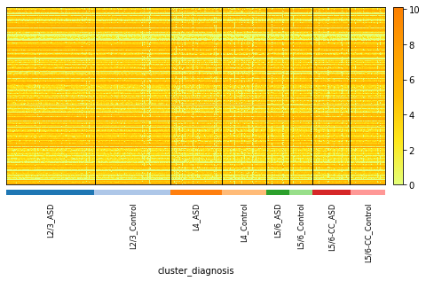
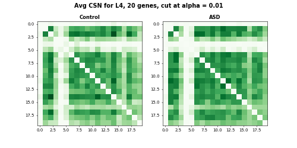

Local Cell-Specific Network (locCSN)
=============================================

`locCSN` is a deconvolution method that utilizes cross-subject scRNA-seq to estimate cell type proportions in bulk RNA-seq data.


How to cite `locCSN`
-------------------
This work has not published yet, please see [bioRxiv](https://www.biorxiv.org/content/10.1101/2021.02.13.431104v1).

Get Started
-----------------
First install `locCSN` pacakge. All locCSN python functions are also stored in [Python Folder](https://github.com/xuranw/locCSN/tree/main/Python). 


```python
pip install locCSN
```

Please download datasets stored in [DataStore](https://github.com/xuranw/locCSN/tree/main/DataStore). 

## Dataset Summary

Dataset            |  Chutype          | ASD Brain              |  Brain Cortex Atlas
-------------------|-------------------|------------------------|---------------------------
Reference          |  Chu et al.(2016) | Velmeshev et al.(2019) | Polioudakis et al.(2019) 
\# of cell         |  1018             |  104,559               |    35,543                 
genes for analysis |  51               |     942                |     444                      
Data Availability  |    GSE75748       |  PRJNA434002           |  [website](http://solo.bmap.ucla.edu/shiny/webapp) 

## Simple Example of locCSN using Chutype Dataset

In this example, we reproduce the results of Chutype dataset in paper. 

### Load Datasets

There are 51 marker genes and 1018 cells from 7 cell types. The gene expression are stored in [logChumaker.txt](https://github.com/xuranw/locCSN/blob/main/DataStore/Chutype/logChumarker.txt) and corresponding cell types in [chutypectname.txt](https://github.com/xuranw/locCSN/blob/main/DataStore/Chutype/chutypectname.txt). Cell types are H1, H9, DEC, EC, HFF, NPC and TF. In our paper, we focus on cell type DEC and NPC.

```python
# Import packages
import locCSN
import os
import scanpy as sc
import pandas as pd
import numpy as np
import matplotlib.pyplot as plt


# Set path to data
os.chdir('yourpathtodata/Chutype/')

# read in Chutype dataset
data = sc.read_text('logChumarker.txt')
data.shape
data = data.transpose() # 1018 cells * 51 genes

cell_type = pd.read_csv('chutypectname.txt', sep = ' ')
data.obs = cell_type   # The observation are labeled with cell types.

# Plot the Heatmap of gene expression
sc.pl.heatmap(data, data.var.index, groupby= "cell_type", dendrogram = False, swap_axes = True, show_gene_labels= True, cmap='Wistia', figsize=(8,6))
```


### Calculate Pearson's Correlation

After loading gene expression matrix and cell types, we first show the absolute Pearson's correlation for DEC and NPC cells. 
```python
data_dec = data[data.obs.cell_type == "DEC", ]
X_dec = data_dec.X.transpose()
data_npc = data[data.obs.cell_type == 'NPC', ]
X_npc = data_npc.X.transpose()

corr_dec = np.corrcoef(X_dec)
corr_npc = np.corrcoef(X_npc)


np.fill_diagonal(corr_dec, 0)
np.fill_diagonal(corr_npc, 0)


plt.subplot(1, 2, 1)
plt.imshow(abs(corr_dec), vmin=0, vmax=0.7, cmap='RdPu')
plt.title('DEC', fontweight ="bold")
plt.subplot(1, 2, 2)
plt.imshow(abs(corr_npc), vmin=0, vmax=0.7, cmap='RdPu')
plt.title("NPC", fontweight = "bold")
plt.suptitle("Absolute Pearson`s Correlation", fontsize = 14, fontweight = "bold")
```
The heatmaps for absolute Pearson`s correlations is 


### Calculate CSN test statistics

Now we calculate the CSN test statistics using function `csn` for cell type DEC and NPC. 

```python
import time
start = time.time()
csn_dec = locCSN.csn(X_dec, dev = True)
end = time.time()
print(end - start) 
start = time.time()
csn_npc = locCSN.csn(X_npc, dev = True)
end = time.time()
print(end - start) 
#1275 pairs need calculation
#60.3697772026062
#903 pairs need calculation
#35.72847938537598
```
Now we show what function `csn` produces.
```python
type(csn_dec) 
# list
len(csn_dec) # 138 cells
# Let's see the test statistics for the first cell in DEC
plt.imshow(csn_dec[0].toarray(), vmin = -6, vmax = 6, cmap = 'coolwarm')
plt.title('DEC one cell', fontweight = "bold")
plt.colorbar()
#plt.savefig('dec_one_cell.png')

```


We compute each pair of genes and store test statistics in an upper diagnol matrix.


```python
from scipy.stats import norm

# Cutoff at norm(0.95)
csn_mat = [(item > norm.ppf(0.95)).astype(int) for item in csn_dec]
avgcsn_dec = sum(csn_mat).toarray()/len(csn_mat) + np.transpose(sum(csn_mat).toarray()/len(csn_mat))
csn_mat = [(item > norm.ppf(0.95)).astype(int) for item in csn_npc]
avgcsn_npc = sum(csn_mat).toarray()/len(csn_mat) + np.transpose(sum(csn_mat).toarray()/len(csn_mat))

plt.subplot(1, 2, 1)
plt.imshow(avgcsn_dec, cmap = "Greens", vmin = 0, vmax = 0.7)
plt.title('DEC', fontweight ="bold")
plt.subplot(1, 2, 2)
plt.imshow(avgcsn_npc, cmap = "Greens", vmin = 0, vmax = 0.7)
plt.title('NPC', fontweight = 'bold')
plt.suptitle("Averaged CSN, cut at alpha = 0.05", fontsize=14, fontweight = "bold")
```
The heatmaps for DEC and NPC are 


## Comparing networks between two groups of cells

For comparison between two groups of cells using CSNs, we use the dataset from Brain Cortex Atlas. We focus on 942 expressed SFARI ASD genes. The comparison sLED, DISTp.

### CSN generation
I will provide the code for generating the CSN matrix and it will take very long to run. CSN results can be found in this [folder](https://github.com/xuranw/locCSN/tree/main/DataStore/Velme). In this example, we are going to use 4 cell types from Nueron Layer as example. 
```python
# import scanpy as sc
# load data
os.chdir('yourpathtodata/Velme/')
data = sc.read_text('Velme_log_mc_cpm_L.txt')
data = data.transpose() 
data.shape # 1778 metacells * 942 genes
meta_L = pd.read_csv('Velme_meta_mc_L.txt', sep = ' ')
data.obs = meta_L
sc.pl.heatmap(data, data.var.index, groupby= ["cluster", "diagnosis"], dendrogram = False, 
              swap_axes = True, cmap='Wistia', figsize=(8,4))

```


```python
data.obs['cluster'].value_counts()
#L2/3       772
#L4         449
#L5/6-CC    341
#L5/6       216

data.obs['diagnosis'].value_counts()
#ASD        936
#Control    842

grouped_data = data.obs.groupby(['cluster', 'diagnosis'])
grouped_data.describe()['sampleID']['count']
#cluster  diagnosis
#L2/3     ASD          414.0
#         Control      358.0
#L4       ASD          238.0
#         Control      211.0
#L5/6     ASD          107.0
#         Control      109.0
#L5/6-CC  ASD          177.0
#         Control      164.0
```
The number of cluster and diagnosis. Now we focus on one cell-group L4

```python
ct_name = "L4"
data_L4 = data[data.obs.cluster == ct_name, :]
data_L4.shape # 449 metacell * 942 genes
mcknn = pd.read_csv('mcknn100_' + ct_name + '.txt', sep = ' ')
mcknn = mcknn.to_numpy()
X_L4 = data_L4.X.transpose()
```
a toy example using a subset of genes

```python
start = time.time()
csn_L4_sub = locCSN.csn_loc(X_L4[0:20, :], mcknn)
end = time.time()
print(end_start)
# 25.824307203292847
```
For storage and export to external analysis, we flatten the CSN test statistics matrix of one cell to a vector, then column-bind the vectors by cells (gene pair * cell). The flattened matrix for $G$ genes and $N$ cells is of size $G(G-1)/2 \times N$.

```python
csn_L4_sub_flat = locCSN.csntoflat(csn_L4_sub)  # 20 genes
csn_L4_sub_flat.shape  #190 gene pairs * 449 cells
```


```python
csn_mat = [(item > norm.ppf(0.99)).astype(int) for item in csn_L4_sub]
meta_L4 = meta_L[meta_L['cluster'] == ct_name]

c_index = (meta_L4['diagnosis'].to_numpy() == 'Control').tolist()
csn_mat_L4_control =  [x for x, y in zip(csn_mat_L4, c_index) if y]
a_index = (meta_L4['diagnosis'].to_numpy() == 'ASD').tolist()
csn_mat_L4_asd =  [x for x, y in zip(csn_mat_L4, a_index) if y]

avgcsn_L4_sub_control = sum(csn_mat_L4_control).toarray()/len(csn_mat_L4_control)
avgcsn_L4_sub_control = + np.transpose(avgcsn_L4_sub_control)
avgcsn_L4_sub_asd = sum(csn_mat_L4_asd).toarray()/len(csn_mat_L4_asd)
avgcsn_L4_sub_asd = + np.transpose(avgcsn_L4_sub_asd)

# save averaged CSN file control + ASD
avgcsn_flat_L4_sub = csntoflat([avgcsn_L4_sub_control, avgcsn_L4_sub_asd])
np.savetxt('avgcsn_asd_data_'+ct_name+'_sub.txt', avgcsn_flat_L4_sub, delimiter='\t')


my_dpi = 50
fig, axes = plt.subplots(nrows=1, ncols=2, figsize=(10, 5), dpi=my_dpi)
print(fig)
print(axes)
fig.suptitle("Avg CSN for L4, 20 genes, cut at alpha = 0.01", fontsize = 14, fontweight = "bold")
axes[0].set_title('Control', fontweight = "bold")
axes[0].imshow(avgcsn_L4_sub_control, cmap = "Greens", vmin = 0, vmax = 0.5)
axes[1].set_title('ASD', fontweight = "bold")
axes[1].imshow(avgcsn_L4_sub_asd, cmap = "Greens", vmin = 0, vmax = 0.5)
#fig.savefig('Velme_Avg_csn_L4_sub.png')
```



#### DISTp

```python
csn_mat_L4_new = csn_mat_L4_control + csn_mat_L4_asd
n_control = len(csn_mat_L4_control)

start = time.time()
D_mat = create_D_mat(csn_mat_L4_new)
end = time.time()
print(end-start)
# 18.536951303482056

pval = locCSN.distance_test(D_mat, n_control)
pval
# 0.252
```

The code for all 942 genes are provided below. Please do not run when you go through the demo. It will take a long time to finish. 
```python
# code for 942 genes of L4. Do not run!!! It will take too long for demo
csn_L4 = locCSN.csn_block_loc(X_L4, mcknn)
csn_L4_flat = locCSN.csntoflat(csn_L4)

# save the flatten the CSN test statistics for sLED
np.savetxt('csn_asd_loc_flat_',ct_name, '.txt', csn_L4_flat, delimiter='\t')

csn_mat_L4 = [(item > norm.ppf(0.99)).astype(int) for item in csn_L4]
meta_L4 = meta_L[meta_L['cluster'] == ct_name]
c_index = (meta_L4['diagnosis'].to_numpy() == 'Control').tolist()
csn_mat_L4_control =  [x for x, y in zip(csn_mat_L4, c_index) if y]
a_index = (meta_L4['diagnosis'].to_numpy() == 'ASD').tolist()
csn_mat_L4_asd =  [x for x, y in zip(csn_mat_L4, a_index) if y]


avgcsn_L4_control = sum(csn_mat_L4_control).toarray()/len(csn_mat_L4_control)
avgcsn_L4_control = + np.transpose(avgcsn_L4_control)
avgcsn_L4_asd = sum(csn_mat_L4_asd).toarray()/len(csn_mat_L4_asd)
avgcsn_L4_asd = + np.transpose(avgcsn_L4_asd)


# save averaged CSN file control + ASD
avgcsn_flat_L4 = csntoflat([avgcsn_L4_control, avgcsn_L4_asd])
np.savetxt('avgcsn_asd_data_'+ct_name+'.txt', avgcsn_flat_L4, delimiter='\t')


csn_mat_L4_new = csn_mat_L4_control + csn_mat_L4_asd
n_control = len(csn_mat_L4_control)

D_mat = create_D_mat(csn_mat_L4_new)
pval = locCSN.distance_test(D_mat, n_control)

```

#### sLED comparison 
sLED is a R package for two-sample test for high-dimensional covariance matrices. Details are in this [GitHub repo](https://github.com/lingxuez/sLED). Let's get started with installation:

```R
install.packages("devtools") ## if not installed
library("devtools")
devtools::install_github("lingxuez/sLED")

```
We then apply sLED to correlation matrix of L4 cell group. 
```R
library(sLED)
# read in gene expression and metadata files
setwd('yourpathtodata/Velme/')
log.mc.cpm.L = read.table('Velme_log_mc_cpm_L.txt')
meta.mc.L = read.table('Velme_meta_mc_L.txt')

# Let's take L4 as an example
ct.name = 'L4'
meta.mc.diag = as.numeric(meta.mc.L$diagnosis[meta.mc.L$cluster == ct.name] == 'ASD')
log.mc.L = data.matrix(log.mc.cpm.L[, meta.mc.L$cluster == ct.name])

log.mc.L[1:5, 1:5]
#          mc_L_4   mc_L_7  mc_L_10  mc_L_25  mc_L_28
#SAMD11  0.000000 0.000000 0.000000 0.000000 0.000000
#SKI     5.797950 4.036630 5.298243 0.000000 3.842033
#SLC45A1 0.000000 2.814837 0.000000 0.000000 2.269254
#RERE    6.489579 5.775307 5.702040 5.917348 5.959781
#CA6     0.000000 1.965827 0.000000 0.000000 1.894637

# rownames of expression are ASD genes
asd.genes = rownames(log.mc.L)

result.cor = sLED(X = t(log.mc.L[, meta.mc.diag == 0]), Y = t(log.mc.L[, meta.mc.diag == 1]), sumabs.seq = 0.2, npermute = 100, seeds = c(1:100), adj.beta = 0)
# 100 permutation started:
# 10 ,20 ,30 ,40 ,50 ,60 ,70 ,80 ,90 ,100 ,permutations finished.

result.cor$pVal
# [1] 0.8

```
Although sLED is designed for covriance matrices, but the idea of comparing differences matrix can be transplate to co-expression measured by CSN. I have modified sLED [code](https://github.com/xuranw/locCSN/blob/main/Rcode/sLEDmodify.R) for CSN adjancency matrices.

The flatten csn test statistics can be found with this [link](https://www.dropbox.com/s/oawyxngaxri1tux/csn_asd_loc_flat_L4.tar.gz?dl=0). Please download and extract file `csn_asd_loc_flat_L4.txt` before excute codes below.

```R
# load functions of sLED for CSNs
source('https://raw.githubusercontent.com/xuranw/locCSN/main/Rcode/sLEDmodify.R')

csn.flat.temp = read.table(paste0('csn_asd_loc_flat_',ct_name, '.txt'))
csn.flat.temp = data.matrix(csn.flat.temp)
csn.t.flat = (csn.flat.temp > qnorm(0.99))+0
result.csn = sLED.csn(X = csn.t.flat[, meta.mc.diag == 0], Y = csn.t.flat[, meta.mc.diag == 1], sumabs.seq = 0.2, npermute = 100, seeds = c(1:100))

result.csn$pVal
```

##### leverage genes and DN genes
```R
# Leverage genes 
lev.L4 = asd.genes[result.csn$leverage > 0]

# DN genes (top 90%)
num.dn = min(which(cumsum(sort(result.csn$leverage, decreasing = T)) > 0.9))
dn.L4.id = which(result.csn$leverage >= sort(result.csn$leverage, decreasing = T)[num.dn])
dn.L4 = asd.genes[dn.L4.id]

```

We also plot the heatmap of averaged CSN for DN genes and 30 random selected genes.

```R
plot.gene.id = c(dn.L4.id, sample(setdiff(1:942, dn.L4, id), 30))
# DN genes + 30 random selected genes

avgcsn.flat = read.table(paste0('avgcsn_asd_data_', ct.name, '.txt'))
avg.csn.ctl = flat.to.matrix(avgcsn_temp[, 1])
avg.csn.asd = flat.to.matrix(avgcsn_temp[, 2])

library(reshape2)
m.data.avgcsn.dn = rbind(melt(avg.csn.ctl[plot.gene.id, plot.gene.id]), 
                         melt(avg.csn.asd[plot.gene.id, plot.gene.id]))
                         
temp.dn = dn.L4.id
temp.non.dn = setdiff(plot.gene.id, dn.L4.id)
# A simple clustering of genes for visualization


```


## Trajectory analysis using Brain Cortex Atlas Dataset

PisCES is a Matlab package in this [GitHub repo](https://github.com/letitiaLiu/PisCES)


## References
* Dai, Hao, et al. "Cell-specific network constructed by single-cell RNA sequencing data." Nucleic acids research 47.11 (2019).
* Chu, Li-Fang, et al. "Single-cell RNA-seq reveals novel regulators of human embryonic stem cell differentiation to definitive endoderm." Genome biology 17.1 (2016).
* Velmeshev, Dmitry, et al. "Single-cell genomics identifies cell type–specific molecular changes in autism." Science 364.6441 (2019).
* Polioudakis, Damon, et al. "A single cell transcriptomic atlas of human neocortical development during mid-gestation." Neuron 103.5 (2019).
* Zhu, Lingxue, et al. "Testing high-dimensional covariance matrices, with application to detecting schizophrenia risk genes." The annals of applied statistics 11.3 (2017).
* Liu, Fuchen, et al. "Global spectral clustering in dynamic networks." Proceedings of the National Academy of Sciences 115.5 (2018).
