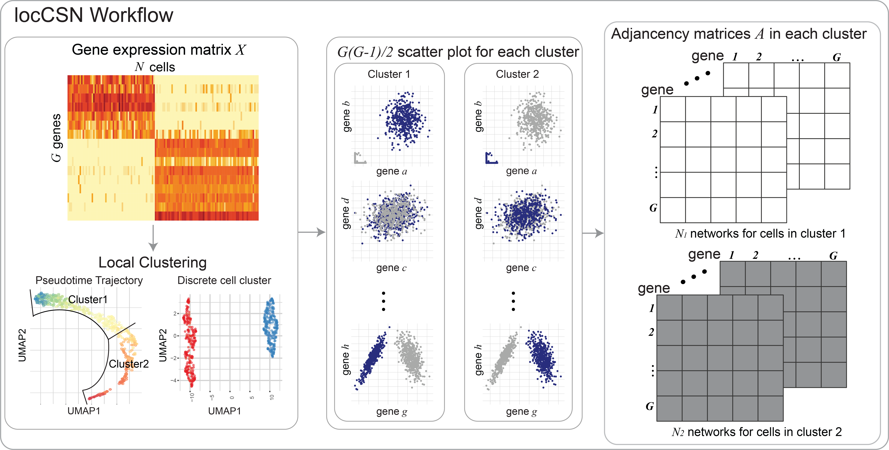
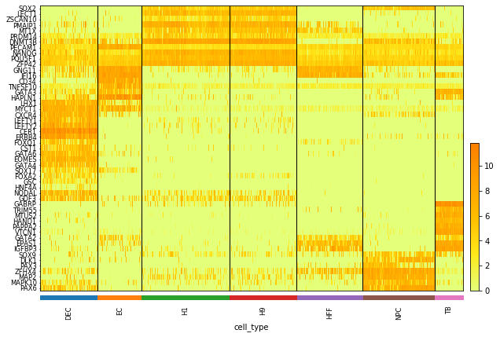
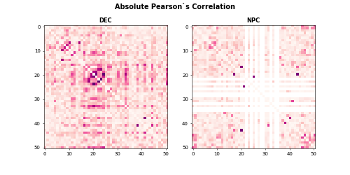
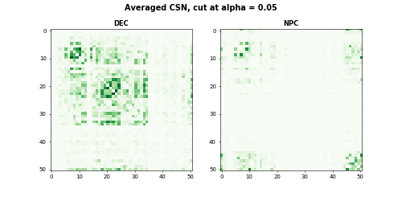

Local Cell-Specific Network (locCSN)
=============================================

`locCSN` is a deconvolution method that utilizes cross-subject scRNA-seq to estimate cell type proportions in bulk RNA-seq data.


How to cite `locCSN`
-------------------
This work has not published yet, please see [bioRxiv](https://www.biorxiv.org/content/10.1101/2021.02.13.431104v1).

Get Started
-----------------
All locCSN python functions are stored in [Python Folder](https://github.com/xuranw/locCSN/tree/main/Python) and datasets are stored in [DataStore](https://github.com/xuranw/locCSN/tree/main/DataStore). Please download datasets and load functions.


#### Import Functions
We first load functions that are required for locCSN.
```{python, eval = FALSE}
import os
import scanpy as sc
import pandas as pd
import numpy as np
import math

from scipy.sparse import csr_matrix, find
import matplotlib.pyplot as plt
import time
from scipy.stats import norm

from joblib import Parallel, delayed
```

#### Load Datasets
In this example, we rerun the Chutype dataset in paper. There are 51 marker genes and 1018 cells from 7 cell types. The gene expression are stored in [logChumaker.txt](https://github.com/xuranw/locCSN/blob/main/DataStore/Chutype/logChumarker.txt) and corresponding cell types in [chutypectname.txt](https://github.com/xuranw/locCSN/blob/main/DataStore/Chutype/chutypectname.txt). Cell types are H1, H9, DEC, EC, HFF, NPC and TF. In our paper, we focus on cell type DEC and NPC.
```{python, eval = FALSE}
# Set path to data
os.chdir('yourpathtodata/')
# read in Chutype dataset
data = sc.read_text('logChumarker.txt')
data.shape
data = data.transpose() # 1018 cells * 51 genes

cell_type = pd.read_csv('chutypectname.txt', sep = ' ')
data.obs = cell_type   # The observation are labeled with cell types.

# Plot the Heatmap of gene expression
sc.pl.heatmap(data, data.var.index, groupby= "cell_type", dendrogram = False, swap_axes = True, show_gene_labels= True, cmap='Wistia', figsize=(8,6))
```



#### Calculate Pearson's Correlation
After loading gene expression matrix and cell types, we first show the absolute Pearson's correlation for DEC and NPC cells. 
```{python, eval = FALSE}
data_dec = data[data.obs.cell_type == "DEC", ]
X_dec = data_dec.X.transpose()
data_npc = data[data.obs.cell_type == 'NPC', ]
X_npc = data_npc.X.transpose()

corr_dec = np.corrcoef(X_dec)
corr_npc = np.corrcoef(X_npc)


np.fill_diagonal(corr_dec, 0)
np.fill_diagonal(corr_npc, 0)


plt.subplot(1, 2, 1)
plt.imshow(abs(corr_dec), vmin=0, vmax=0.7, cmap='RdPu')
plt.title('DEC', fontweight ="bold")
plt.subplot(1, 2, 2)
plt.imshow(abs(corr_npc), vmin=0, vmax=0.7, cmap='RdPu')
plt.title("NPC", fontweight = "bold")
plt.suptitle("Absolute Pearson`s Correlation", fontsize = 14, fontweight = "bold")
```
The heatmaps for absolute Pearson`s correlations is 




#### Calculate CSN test statistics
Now we calculate the CSN test statistics using function `csn` for cell type DEC and NPC. 
```{python, eval = FALSE}
start = time.time()
csn_dec = csn(X_dec, dev = True)
end = time.time()
print(end - start) 
start = time.time()
csn_npc = csn(X_npc, dev = True)
end = time.time()
print(end - start) 
#1275 pairs need calculation
#60.3697772026062
#903 pairs need calculation
#35.72847938537598
```
Now we show what function `csn` produces.
```{python, eval = FALSE}
type(csn_dec) 
# list
len(csn_dec) # 138 cells
# Let's see the test statistics for the first cell in DEC
plt.imshow(csn_dec[0].toarray(), vmin = -6, vmax = 6, cmap = 'coolwarm')
plt.title('DEC one cell', fontweight = "bold")
plt.colorbar()
#plt.savefig('dec_one_cell.png')

```


We compute each pair of genes and store test statistics in an upper diagnol matrix.


```{python, eval = FALSE}
# Cutoff at norm(0.99)
csn_mat = [(item > norm.ppf(0.95)).astype(int) for item in csn_dec]
avgcsn_dec = sum(csn_mat).toarray()/len(csn_mat) + np.transpose(sum(csn_mat).toarray()/len(csn_mat))
csn_mat = [(item > norm.ppf(0.95)).astype(int) for item in csn_npc]
avgcsn_npc = sum(csn_mat).toarray()/len(csn_mat) + np.transpose(sum(csn_mat).toarray()/len(csn_mat))

plt.subplot(1, 2, 1)
plt.imshow(avgcsn_dec, cmap = "Greens", vmin = 0, vmax = 0.7)
plt.title('DEC', fontweight ="bold")
plt.subplot(1, 2, 2)
plt.imshow(avgcsn_npc, cmap = "Greens", vmin = 0, vmax = 0.7)
plt.title('NPC', fontweight = 'bold')
plt.suptitle("Averaged CSN, cut at alpha = 0.05", fontsize=14, fontweight = "bold")
```
The heatmaps for DEC and NPC are 



## References
* Dai, Hao, et al. "Cell-specific network constructed by single-cell RNA sequencing data." Nucleic acids research 47.11 (2019).
* Chu, Li-Fang, et al. "Single-cell RNA-seq reveals novel regulators of human embryonic stem cell differentiation to definitive endoderm." Genome biology 17.1 (2016).
