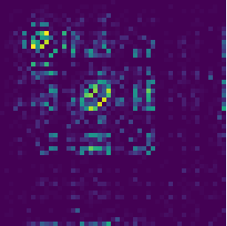
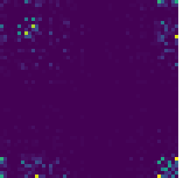

Local Cell-Specific Network (locCSN)
=============================================

`locCSN` is a deconvolution method that utilizes cross-subject scRNA-seq to estimate cell type proportions in bulk RNA-seq data.


How to cite `locCSN`
-------------------
This work is not published yet, please see [bioRxiv](https://www.biorxiv.org/content/10.1101/2021.02.13.431104v1).

Get Started
-----------------
All locCSN python functions are stored in [Python Folder](https://github.com/xuranw/locCSN/tree/main/Python) and datasets are stored in [DataStore](https://github.com/xuranw/locCSN/tree/main/DataStore). Please download datasets and load functions.


#### Import Functions
We first load functions that are required for locCSN.
```{python, eval = FALSE}
import os
import pandas as pd
import numpy as np
import math

from scipy.sparse import csr_matrix, find
import matplotlib.pyplot as plt
import time
from scipy.stats import norm

from joblib import Parallel, delayed
import time, math
```

#### Load Datasets
In this example, we rerun the Chutype dataset in paper. There are 51 marker genes and 1018 cells from 7 cell types. The gene expression are stored in [logChumaker.txt](https://github.com/xuranw/locCSN/blob/main/DataStore/logChumarker.txt) and corresponding cell types in [chutypect.txt](https://github.com/xuranw/locCSN/blob/main/DataStore/chutypect.txt). Cell types are denoted by number 1-7. In our paper, we focus on cell type DEC and NPC, which are denoted as 3 and 6 in chutypect.txt.
```{python, eval = FALSE}
# Set path to data
os.chdir('yourpathtodata/')
# read in Chutype dataset
data = pd.read_csv('logChumarker.txt', sep = ' ')
# 51 genes * 1018 cells

data_temp = data.values
cell_type = pd.read_csv('chutypect.txt', sep = ' ')
celltype = cell_type.x
```

#### Calculate CSNs
After loading gene expression matrix and cell types, we calculate CSN test statistics with DEC and NPC cell types. 
```{python, eval = FALSE}
data_full = data_temp[:, celltype == 3]; # DEC

start = time.time()
csn_stat = csn(data_full, dev = True)
end = time.time()
print(end - start) # 19.225603342056274s

# Cutoff at norm(0.99)
csn_mat = [(item > norm.ppf(0.99)).astype(int) for item in csn_stat]
avgcsn = sum(csn_mat).toarray()/len(csn_mat) + np.transpose(sum(csn_mat).toarray()/len(csn_mat))
plt.imshow(avgcsn)  # plot of averaged CSN in one cell type
# plt.imsave('py_avgcsn_DEC.pdf', avgcsn, dpi = 200)
```
The heatmaps for DEC is 



Similarly, we calculate CSN test statistics for NPC.
```{python, eval = FALSE}
data_full = data_temp[:, celltype == 6]; # NPC

start = time.time()
csn_stat = csn(data_full, dev = True)
end = time.time()
print(end - start) # 11.016549110412598s

# Cutoff at norm(0.99)
csn_mat = [(item > norm.ppf(0.99)).astype(int) for item in csn_stat]
avgcsn = sum(csn_mat).toarray()/len(csn_mat) + np.transpose(sum(csn_mat).toarray()/len(csn_mat))
plt.imshow(avgcsn)  # plot of averaged CSN in one cell type
# plt.imsave('py_avgcsn_NPC.pdf', avgcsn, dpi = 200)
```
The heatmaps for NPC is 


