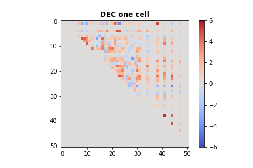
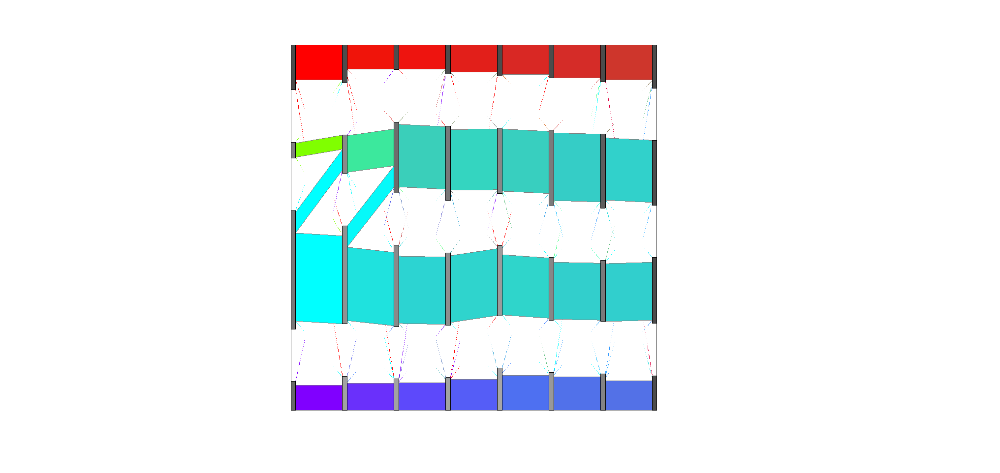

Local Cell-Specific Network (locCSN)
=============================================

`locCSN` is a deconvolution method that utilizes cross-subject scRNA-seq to estimate cell type proportions in bulk RNA-seq data.


How to cite `locCSN`
-------------------
This work has not published yet, please see [bioRxiv](https://www.biorxiv.org/content/10.1101/2021.02.13.431104v1).

Get Started
-----------------
First install `locCSN` pacakge. All locCSN python functions are also stored in [Python Folder](https://github.com/xuranw/locCSN/tree/main/Python). 


```python
pip install locCSN
```

Please download datasets stored in [DataStore](https://github.com/xuranw/locCSN/tree/main/DataStore). Large datasets can be accessed by this [link](https://www.dropbox.com/sh/yhwaubuo44zs344/AAA9Di_NdwbOcD1K5oDC5pwFa?dl=0).

## Dataset Summary

Dataset            |  Chutype          | ASD Brain              |  Brain Cortex Atlas
-------------------|-------------------|------------------------|---------------------------
Reference          |  Chu et al.(2016) | Velmeshev et al.(2019) | Polioudakis et al.(2019) 
\# of cell         |  1018             |  104,559               |    35,543                 
genes for analysis |  51               |     942                |     444                      
Data Availability  |    GSE75748       |  PRJNA434002           |  [website](http://solo.bmap.ucla.edu/shiny/webapp) 

## Simple Example of locCSN using Chutype Dataset

In this example, we reproduce the results of Chutype dataset in paper. 

### Load Datasets

There are 51 marker genes and 1018 cells from 7 cell types. The gene expression are stored in [logChumaker.txt](https://github.com/xuranw/locCSN/blob/main/DataStore/Chutype/logChumarker.txt) and corresponding cell types in [chutypectname.txt](https://github.com/xuranw/locCSN/blob/main/DataStore/Chutype/chutypectname.txt). Cell types are H1, H9, DEC, EC, HFF, NPC and TF. In our paper, we focus on cell type DEC and NPC.

```python
# Import packages
import locCSN
import os
import scanpy as sc
import pandas as pd
import numpy as np
import matplotlib.pyplot as plt


# Set path to data
os.chdir('yourpathtodata/Chutype/')

# read in Chutype dataset
data = sc.read_text('logChumarker.txt')
data.shape
data = data.transpose() # 1018 cells * 51 genes

cell_type = pd.read_csv('chutypectname.txt', sep = ' ')
data.obs = cell_type   # The observation are labeled with cell types.

# Plot the Heatmap of gene expression
sc.pl.heatmap(data, data.var.index, groupby= "cell_type", dendrogram = False, swap_axes = True, show_gene_labels= True, cmap='Wistia', figsize=(8,6))
```


### Calculate Pearson's Correlation

After loading gene expression matrix and cell types, we first show the absolute Pearson's correlation for DEC and NPC cells. 

```python
data_dec = data[data.obs.cell_type == "DEC", ]
X_dec = data_dec.X.transpose()
data_npc = data[data.obs.cell_type == 'NPC', ]
X_npc = data_npc.X.transpose()

corr_dec = np.corrcoef(X_dec)
corr_npc = np.corrcoef(X_npc)


np.fill_diagonal(corr_dec, 0)
np.fill_diagonal(corr_npc, 0)


plt.subplot(1, 2, 1)
plt.imshow(abs(corr_dec), vmin=0, vmax=0.7, cmap='RdPu')
plt.title('DEC', fontweight ="bold")
plt.subplot(1, 2, 2)
plt.imshow(abs(corr_npc), vmin=0, vmax=0.7, cmap='RdPu')
plt.title("NPC", fontweight = "bold")
plt.suptitle("Absolute Pearson`s Correlation", fontsize = 14, fontweight = "bold")
```
The heatmaps for absolute Pearson`s correlations is 


### Calculate CSN test statistics

Now we calculate the CSN test statistics using function `csn` for cell type DEC and NPC. 

```python
import time
start = time.time()
csn_dec = locCSN.csn(X_dec, dev = True)
end = time.time()
print(end - start) 
start = time.time()
csn_npc = locCSN.csn(X_npc, dev = True)
end = time.time()
print(end - start) 
#1275 pairs need calculation
#60.3697772026062
#903 pairs need calculation
#35.72847938537598
```
Now we show what function `csn` produces. For a specific cell, we compute each pair of genes and store test statistics in an upper diagnol matrix.

```python
type(csn_dec) 
# list
len(csn_dec) # 138 cells
# Let's see the test statistics for the first cell in DEC
plt.imshow(csn_dec[0].toarray(), vmin = -6, vmax = 6, cmap = 'coolwarm')
plt.title('DEC one cell', fontweight = "bold")
plt.colorbar()
#plt.savefig('dec_one_cell.png')

```


As we stated in [our paper](https://www.biorxiv.org/content/10.1101/2021.02.13.431104v2#page): ''Althogh individual CSNs are estimated with considerable noise, average CSNs provide stable estimates of network structure, which provide better estimates of gene block structure. '' For CSN test statistics matrices within a cell group, we first threshold test statistics and averaged the adjacency matrices with the cell group. The averaged CSN is the estimate of gene co-expression of the cell group. In this example, we thresholded at $\alpha = 0.05$. 

```python
from scipy.stats import norm

# Cutoff at norm(0.95)
csn_mat = [(item > norm.ppf(0.95)).astype(int) for item in csn_dec]
avgcsn_dec = sum(csn_mat).toarray()/len(csn_mat) + np.transpose(sum(csn_mat).toarray()/len(csn_mat))
csn_mat = [(item > norm.ppf(0.95)).astype(int) for item in csn_npc]
avgcsn_npc = sum(csn_mat).toarray()/len(csn_mat) + np.transpose(sum(csn_mat).toarray()/len(csn_mat))

plt.subplot(1, 2, 1)
plt.imshow(avgcsn_dec, cmap = "Greens", vmin = 0, vmax = 0.7)
plt.title('DEC', fontweight ="bold")
plt.subplot(1, 2, 2)
plt.imshow(avgcsn_npc, cmap = "Greens", vmin = 0, vmax = 0.7)
plt.title('NPC', fontweight = 'bold')
plt.suptitle("Averaged CSN, cut at alpha = 0.05", fontsize=14, fontweight = "bold")
```
The heatmaps for DEC and NPC are 


## Comparing networks between two groups of cells

For comparison between two groups of cells using CSNs, we use the dataset from ASD Brain dataset (Velmeshev et al. 2019). We focus on 942 expressed SFARI ASD genes and compare gene co-expression networks of control and ASD group using Pearson's correlation and CSN. The comparison methods are sLED and DISTp.

### Data Summary
The ASD Brain dataset has 104,559 cells of 16 cell types and is very sparse. We use Metacell(Baran et al. 2019) to reduce the sparsity for the dataset. Please see [metacell website](https://tanaylab.github.io/metacell/) for how to generate metacells. The following analysis is based on metacells, which are stored in this [folder](https://github.com/xuranw/locCSN/tree/main/DataStore/Velme). 

For demonstration, we start with metacell expression of 4 Neuron layer cell types: L2/3, L4, L5/6 and L5/6-CC and 942 SFARI genes. The metacell expressions are stored in this [folder](https://github.com/xuranw/locCSN/tree/main/DataStore/Velme). Please download them in your own directory.

Let's take a look at the expression of neuron layers. There are 1778 metacells and 942 genes.
```python
# import scanpy as sc
# load data
os.chdir('yourpathtodata/Velme/')
data = sc.read_text('Velme_log_mc_cpm_L.txt')
data = data.transpose() 
data.shape # 1778 metacells * 942 genes
meta_L = pd.read_csv('Velme_meta_mc_L.txt', sep = ' ') 
meta_L.columns
# Index(['sampleID', 'broad.cluster', 'cluster', 'diagnosis'], dtype='object')
data.obs = meta_L
sc.pl.heatmap(data, data.var.index, groupby= ["cluster", "diagnosis"], dendrogram = False, swap_axes = True, cmap='Wistia', figsize=(8,4))

```


The metadata of metacells can be accessed in `data.obs`. 
```python
data.obs['cluster'].value_counts()
#L2/3       772
#L4         449
#L5/6-CC    341
#L5/6       216

data.obs['diagnosis'].value_counts()
#ASD        936
#Control    842

grouped_data = data.obs.groupby(['cluster', 'diagnosis'])
grouped_data.describe()['sampleID']['count']
#cluster  diagnosis
#L2/3     ASD          414.0
#         Control      358.0
#L4       ASD          238.0
#         Control      211.0
#L5/6     ASD          107.0
#         Control      109.0
#L5/6-CC  ASD          177.0
#         Control      164.0
```

### CSN Construction of L4 cell-group
CSN test statistics are calcaulted within cell group. Now we focus on one cell-group: L4, which contains 449 metacells (238 ASD + 211 Control). Let's first subset the neuron layers to L4 cell group.

```python
ct_name = "L4"
data_L4 = data[data.obs.cluster == ct_name, :]
data_L4.shape # 449 metacell * 942 genes
mcknn = pd.read_csv('mcknn100_' + ct_name + '.txt', sep = ' ')
mcknn = mcknn.to_numpy()
X_L4 = data_L4.X.transpose()
```
The runtime of 942 genes is longer than 1 hour. Therefore we provide a toy example only use a subset of 20 genes and the runtime is approximately 20-40s.

```python
start = time.time()
csn_L4_sub = locCSN.csn_loc(X_L4[0:20, :], mcknn)
end = time.time()
print(end_start)
# 25.824307203292847
```

For storage and export to different software platforms, we flatten the CSN test statistics matrices. For each CSN matrix, we vectorize it to a vector, then column-bind the vectors by cells. The final csn flatten matrix is a gene pair * cell matrix. The flattened matrix for $G$ genes and $N$ cells is of size $G(G-1)/2 \times N$.

```python
csn_L4_sub_flat = locCSN.csntoflat(csn_L4_sub)  # 20 genes
csn_L4_sub_flat.shape  #190 gene pairs * 449 cells
# np.savetxt('csn_'+ct_name+'_sub_flat.txt', csn_L4_sub_flat, delimiter = '\t')
```

For analysis and visualization, we threshold the CSN test statistics at $\alpha = 0.01$ and average CSN within ASD and Control group respectively.
```python
csn_mat = [(item > norm.ppf(0.99)).astype(int) for item in csn_L4_sub]
meta_L4 = meta_L[meta_L['cluster'] == ct_name]

c_index = (meta_L4['diagnosis'].to_numpy() == 'Control').tolist()
csn_mat_L4_control =  [x for x, y in zip(csn_mat_L4, c_index) if y]
a_index = (meta_L4['diagnosis'].to_numpy() == 'ASD').tolist()
csn_mat_L4_asd =  [x for x, y in zip(csn_mat_L4, a_index) if y]

avgcsn_L4_sub_control = sum(csn_mat_L4_control).toarray()/len(csn_mat_L4_control)
avgcsn_L4_sub_control = + np.transpose(avgcsn_L4_sub_control)
avgcsn_L4_sub_asd = sum(csn_mat_L4_asd).toarray()/len(csn_mat_L4_asd)
avgcsn_L4_sub_asd = + np.transpose(avgcsn_L4_sub_asd)

my_dpi = 50
fig, axes = plt.subplots(nrows=1, ncols=2, figsize=(10, 5), dpi=my_dpi)
print(fig)
print(axes)
fig.suptitle("Avg CSN for L4, 20 genes, cut at alpha = 0.01", fontsize = 14, fontweight = "bold")
axes[0].set_title('Control', fontweight = "bold")
axes[0].imshow(avgcsn_L4_sub_control, cmap = "Greens", vmin = 0, vmax = 0.5)
axes[1].set_title('ASD', fontweight = "bold")
axes[1].imshow(avgcsn_L4_sub_asd, cmap = "Greens", vmin = 0, vmax = 0.5)
#fig.savefig('Velme_Avg_csn_L4_sub.png')
```


For visualization in different software platform, we store averaged CSN for ASD and Control group in text file.
```python
# save averaged CSN file control + ASD
avgcsn_flat_L4_sub = csntoflat([avgcsn_L4_sub_control, avgcsn_L4_sub_asd])
np.savetxt('avgcsn_asd_data_'+ct_name+'_sub.txt', avgcsn_flat_L4_sub, delimiter='\t')
```

### Comparison of ASD and Control groups
In this section, we demonstrate how we compare the gene co-expression using DISTp and sLED.
#### DISTp
We also inplement the test of DISTp in `locCSN` package. DISTp requires CSN adjacency matrices that are arranged by cell group. 
```python
# Arrange adjacency matrices by cell group
csn_mat_L4_new = csn_mat_L4_control + csn_mat_L4_asd
n_control = len(csn_mat_L4_control)  # number of the first group

start = time.time()
pval = locCSN.DISTp(csn_mat_L4_new, n_control)
end = time.time()
print(end-start)
# 33.536951303482056

pval
# 0.252
```
The DISTp pvalue for this toy example is 0.252, which is not significant. Looking at the heatmap of 


The code for all 942 genes are provided below. <span style="color:red"> **Please do not run when you go through the demo.** </span> It will take a long time to finish. 
```python
# code for 942 genes of L4. Do not run!!! It will take too long for demo
csn_L4 = locCSN.csn_block_loc(X_L4, mcknn)
csn_L4_flat = locCSN.csntoflat(csn_L4)

# save the flatten the CSN test statistics for sLED. This is a extremely big file
np.savetxt('csn_asd_loc_flat_',ct_name, '.txt', csn_L4_flat, delimiter='\t')

csn_mat_L4 = [(item > norm.ppf(0.99)).astype(int) for item in csn_L4]
meta_L4 = meta_L[meta_L['cluster'] == ct_name]
c_index = (meta_L4['diagnosis'].to_numpy() == 'Control').tolist()
csn_mat_L4_control =  [x for x, y in zip(csn_mat_L4, c_index) if y]
a_index = (meta_L4['diagnosis'].to_numpy() == 'ASD').tolist()
csn_mat_L4_asd =  [x for x, y in zip(csn_mat_L4, a_index) if y]


avgcsn_L4_control = sum(csn_mat_L4_control).toarray()/len(csn_mat_L4_control)
avgcsn_L4_control = + np.transpose(avgcsn_L4_control)
avgcsn_L4_asd = sum(csn_mat_L4_asd).toarray()/len(csn_mat_L4_asd)
avgcsn_L4_asd = + np.transpose(avgcsn_L4_asd)


# save averaged CSN file control + ASD
avgcsn_flat_L4 = csntoflat([avgcsn_L4_control, avgcsn_L4_asd])
np.savetxt('avgcsn_asd_data_'+ct_name+'.txt', avgcsn_flat_L4, delimiter='\t')


csn_mat_L4_new = csn_mat_L4_control + csn_mat_L4_asd
n_control = len(csn_mat_L4_control)

pval = locCSN.DISTp(csn_mat_L4_new, n_control)
pval
# 0.039
```

#### sLED comparison 
sLED is a R package for two-sample test for high-dimensional covariance matrices. Details are in this [GitHub repo](https://github.com/lingxuez/sLED). Let's get started with installation:

```R
install.packages("devtools") ## if not installed
library("devtools")
devtools::install_github("lingxuez/sLED")

```
Apply sLED to correlation matrix of L4 cell group. 

```R
library(sLED)
# read in gene expression and metadata files
setwd('yourpathtodata/Velme/')
log.mc.cpm.L = read.table('Velme_log_mc_cpm_L.txt')
meta.mc.L = read.table('Velme_meta_mc_L.txt')

# Let's take L4 as an example
ct.name = 'L4'
meta.mc.diag = as.numeric(meta.mc.L$diagnosis[meta.mc.L$cluster == ct.name] == 'ASD')
log.mc.L = data.matrix(log.mc.cpm.L[, meta.mc.L$cluster == ct.name])

log.mc.L[1:5, 1:5]
#          mc_L_4   mc_L_7  mc_L_10  mc_L_25  mc_L_28
#SAMD11  0.000000 0.000000 0.000000 0.000000 0.000000
#SKI     5.797950 4.036630 5.298243 0.000000 3.842033
#SLC45A1 0.000000 2.814837 0.000000 0.000000 2.269254
#RERE    6.489579 5.775307 5.702040 5.917348 5.959781
#CA6     0.000000 1.965827 0.000000 0.000000 1.894637

# rownames of expression are ASD genes
asd.genes = rownames(log.mc.L)

result.cor = sLED(X = t(log.mc.L[, meta.mc.diag == 0]), Y = t(log.mc.L[, meta.mc.diag == 1]), sumabs.seq = 0.2, npermute = 100, seeds = c(1:100), adj.beta = 0)
# 100 permutation started:
# 10 ,20 ,30 ,40 ,50 ,60 ,70 ,80 ,90 ,100 ,permutations finished.

result.cor$pVal
# [1] 0.8

```
Although sLED is designed for covariance matrices, the idea of comparing differences matrix can be applied to co-expression measured by CSN. I have modified sLED [code](https://github.com/xuranw/locCSN/blob/main/Rcode/sLEDmodify.R) for CSN adjancency matrices.

The flatten csn test statistics can be found with this [link](https://www.dropbox.com/s/oawyxngaxri1tux/csn_asd_loc_flat_L4.tar.gz?dl=0). Please download and extract file `csn_asd_loc_flat_L4.txt` before excuting codes below. 

```R
# load functions of sLED for CSNs
source('https://raw.githubusercontent.com/xuranw/locCSN/main/Rcode/sLEDmodify.R')

csn.flat.temp = read.table(paste0('csn_asd_loc_flat_',ct_name, '.txt'))
csn.flat.temp = data.matrix(csn.flat.temp)
csn.t.flat = (csn.flat.temp > qnorm(0.99)) + 0 #Threshold at alpha = 0.01
result.csn = sLED.csn(X = csn.t.flat[, meta.mc.diag == 0], Y = csn.t.flat[, meta.mc.diag == 1], sumabs.seq = 0.2, npermute = 100, seeds = c(1:100))

result.csn$pVal
# [1] 0
```
sLED-CSN have significant p-value for comparison ASD and Control groups for L4 cell group. 


#### leverage genes and DN genes
We can also identify a small cluster of leverage genes corresponding to the non-zero entries of the sparse leading eigenvector. The differential network genes are the ones that explain 90\% of the variability among the leverage genes.leverage genes are the non-zero entries of the sparse leading eigenvector. We can get leverage genes and DN genes with code below.
```R
# Leverage genes 
lev.L4 = asd.genes[result.csn$leverage > 0]

# DN genes (top 90%)
num.dn = min(which(cumsum(sort(result.csn$leverage, decreasing = T)) > 0.9))  # 27
dn.L4.id = which(result.csn$leverage >= sort(result.csn$leverage, decreasing = T)[num.dn])
dn.L4 = asd.genes[dn.L4.id]

```

We also plot the heatmap of averaged CSN for DN genes plus 30 random selected genes. DN genes are boxed in the heatmaps.

```R
plot.gene.id = c(dn.L4.id, sample(setdiff(1:942, dn.L4, id), 30))
# DN genes + 30 random selected genes

avgcsn.flat = read.table(paste0('avgcsn_asd_data_', ct.name, '.txt'))
avg.csn.ctl = flat.to.matrix(avgcsn_temp[, 1])
avg.csn.asd = flat.to.matrix(avgcsn_temp[, 2])

library(reshape2)
m.data.avgcsn.dn = rbind(melt(avg.csn.ctl[plot.gene.id, plot.gene.id]), 
                         melt(avg.csn.asd[plot.gene.id, plot.gene.id]))
                         
temp.dn = dn.L4.id
temp.non.dn = setdiff(plot.gene.id, dn.L4.id)
# A simple clustering of genes for visualization
dist.dn = dist(cbind(avg.csn.ctl[temp.dn, temp.dn], avg.csn.asd[temp.dn, temp.dn]));
dist.non.dn = dist(cbind(avg.csn.ctl[temp.non.dn, temp.non.dn], avg.csn.asd[temp.non.dn, temp.non.dn]))
hclust.dn = hclust(dist.dn); hclust.non.dn = hclust(dist.non.dn)
match.temp.dn = match(temp.dn, plot.gene.id); 
match.temp.non.dn = match(temp.non.dn, plot.gene.id);
order.temp = c(match.temp.dn[hclust.dn$order], match.temp.non.dn[hclust.non.dn$order])

n.dn.withnull = length(plot.gene.id); n.dn = length(dn.L4.id)
m.data.avgcsn.dn$X1 = factor(m.data.avgcsn.dn$X1, levels = order.temp)
m.data.avgcsn.dn$X2 = factor(m.data.avgcsn.dn$X2, levels = order.temp)
 
colnames(m.data.avgcsn.dn) = c('gene.x', 'gene.y', 'avgcsn')
m.data.avgcsn.dn$group = factor(rep(c('Control', 'ASD'), each = n.dn.withnull^2), levels = c('Control', 'ASD'))

data.rec <- data.frame(y=c(0.5, n.dn+0.5, n.dn+0.5, 0.5), x=c(0.5, 0.5, n.dn+0.5, n.dn+0.5))

p1 = ggplot(m.data.avgcsn.dn, aes(gene.x, gene.y, fill = avgcsn)) + geom_tile(size = 0) + 
    geom_polygon(data = data.rec, aes(x=x, y=y), colour="black", fill=NA) + 
    facet_wrap(~group) + coord_fixed() +
    scale_fill_distiller(palette = 'Greens', direction = 1) + theme_minimal() + 
    theme(axis.text.x = element_blank(), axis.text.y = element_blank(), 
          axis.ticks.x = element_blank(), axis.ticks.y = element_blank()) + 
    ggtitle(paste0('L4: ', n.dn, ' DN genes')) + 
    theme(axis.title = element_blank()) + guides(fill = guide_colorbar(barwidth = 0.5, barheight = 3))
    
diff.avg.csn.dn = avg.csn.asd[plot.gene.id, plot.gene.id] - avg.csn.ctl[plot.gene.id, plot.gene.id]
m.diff.avg.csn = melt(diff.avg.csn.dn)
m.diff.avg.csn$X1 = factor(m.diff.avg.csn$X1, levels = order.temp)
m.diff.avg.csn$X2 = factor(m.diff.avg.csn$X2, levels = order.temp)
colnames(m.diff.avg.csn) = c('gene.x', 'gene.y', 'avgcsn')
lim.max = max(0.7, max(abs(m.diff.avg.csn$avgcsn)))

p2 = ggplot(m.diff.avg.csn, aes(gene.x, gene.y, fill = avgcsn)) + geom_tile(size = 0) + 
    geom_polygon(data = data.rec, aes(x=x, y=y), colour="black", fill=NA) + coord_fixed() +
    scale_fill_distiller(palette = 'RdBu', direction = -1, limit = c(-lim.max, lim.max)) + theme_minimal() + 
    theme(axis.text.x = element_blank(), axis.text.y = element_blank(), 
          axis.ticks.x = element_blank(), axis.ticks.y = element_blank(), 
          axis.title = element_blank()) + 
    ggtitle('Difference') + labs(fill = expression(paste(Delta, 'avgcsn'))) + 
    guides(fill = guide_colorbar(barwidth = 0.5, barheight = 3))

library(cowplot)
p_comb = plot_grid(p1, p2, ncol = 2, rel_widths = c(1.6, 1))
p_comb
```


## Trajectory analysis using Brain Cortex Atlas Dataset
For the Brain Cortex Altas Data (Polioudakis et al. 2019), I will only show the downstream analysis after obtaining the averaged CSN for 7 pseudotime points and how we get the Sankey plot for D-curve. The averaged CSN are stored in this [folder](https://github.com/xuranw/locCSN/tree/main/DataStore/AtlasND). 

PisCES (Liu et al. 2018) is a Matlab package in this [GitHub repo](https://github.com/letitiaLiu/PisCES)
```matlab
load('avgcsn_Dcurve_list.mat')  %avgcsn_Dcurve_list 
% this is a list of averaged CSN for 8 pseudotime points: P, IP, Ex

T = 8;
N = size(avgcsn_Dcurve_list{1}, 1);
net_temp = csnto3dmat(avgcsn_Dcurve_list);
Z = PisCES(net_temp, 'T', 0.05*ones(T, 2));
K = max(max(Z));
A_rec = avgcsn_Dcurve_list;
param.min_flow_size = N/K^2;
param.frac_min_flow_size = 0.15;
[newZ] = layout_timeline(A_rec, Z', param);

```
This section is not necessary. We are manually reordered the gene community so that the dense gene community is the first gene community.

```matlab
% Manually change gene community order
for i = 1:8
    index = find(newZ(:, i) == 3);
    newZ(newZ(:, i) == 2, i) = 3;
    newZ(newZ(:, i) == 1, i) = 2;
    newZ(index, i) = 1;
end
```
Create sankey plot.

```Matlab
[flow_rec, cluster_rec] = create_sankey_tables(newZ, A_rec);
param.add_class_labels = 1;
param.draw_whole_timeline = 1;
param.draw_paired_plots = 0;
param.which_paired_plots = 1:T-1;
param.draw_whole_timeline_with_heatmap = 0;
param.draw_all_plots = 0;
[paired_param] = make_timeline_and_paired_plots(newZ, A_rec, flow_rec,cluster_rec, param);

```



## References
* Dai, Hao, et al. "Cell-specific network constructed by single-cell RNA sequencing data." Nucleic acids research 47.11 (2019).
* Chu, Li-Fang, et al. "Single-cell RNA-seq reveals novel regulators of human embryonic stem cell differentiation to definitive endoderm." Genome biology 17.1 (2016).
* Velmeshev, Dmitry, et al. "Single-cell genomics identifies cell type–specific molecular changes in autism." Science 364.6441 (2019).
* Baran, Yael, et al. "MetaCell: analysis of single-cell RNA-seq data using K-nn graph partitions." Genome biology 20.1 (2019).
* Polioudakis, Damon, et al. "A single cell transcriptomic atlas of human neocortical development during mid-gestation." Neuron 103.5 (2019).
* Zhu, Lingxue, et al. "Testing high-dimensional covariance matrices, with application to detecting schizophrenia risk genes." The annals of applied statistics 11.3 (2017).
* Liu, Fuchen, et al. "Global spectral clustering in dynamic networks." Proceedings of the National Academy of Sciences 115.5 (2018).
